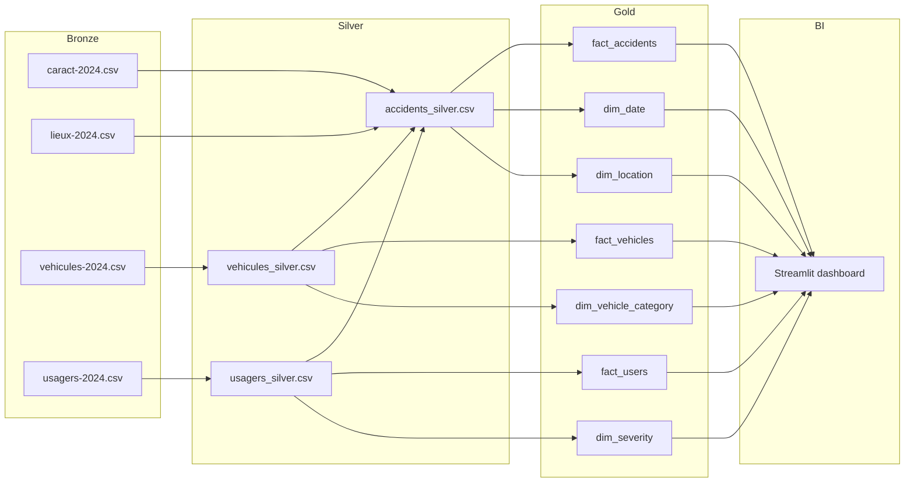

# French Road Safety Data Integration

Data Integration & Applications (ST2DLDI) lab project. The dataset is the
French Road Safety Open Data ("Accidents corporels", 2024) from data.gouv.fr,
split into four files: `caract`, `lieux`, `vehicules`, `usagers`.

The project implements a Medallion architecture (Bronze -> Silver -> Gold)
and exposes the Gold layer through a Streamlit dashboard.

## Project structure

```
data/
  bronze/   raw CSV files as downloaded from data.gouv.fr
  silver/   cleaned, standardized, enriched tables
  gold/     analytical model: fact and dimension tables
01_data_profiling.ipynb   Deliverable 1a: dataset structure and column inventory (Part 1.A)
02_data_quality.ipynb     Deliverable 1b: missing values, consistency checks, quality summary (Part 1.B/C/D), with charts
03_build_silver.ipynb     Deliverable 2: Silver layer transformations (Part 2.A)
04_build_gold.ipynb       Deliverable 3: Gold layer star schema (Part 2.B)
app.py                     Streamlit dashboard (BI layer)
requirements.txt
```

There are no separate `.md` report files: the write-up for each deliverable
(explanations, findings, recommendations) lives directly inside the matching
notebook as markdown cells, next to the code and outputs that produced it.
Each notebook is committed already executed, so opening it on GitHub shows
the tables, charts and numbers without having to re-run anything.

## How to run locally

Install the notebook dependencies, then run the notebooks in order (Jupyter
Notebook, JupyterLab, or VS Code), or from the command line with nbconvert:

```
pip install -r requirements-notebooks.txt
jupyter nbconvert --to notebook --execute --inplace 01_data_profiling.ipynb
jupyter nbconvert --to notebook --execute --inplace 02_data_quality.ipynb
jupyter nbconvert --to notebook --execute --inplace 03_build_silver.ipynb
jupyter nbconvert --to notebook --execute --inplace 04_build_gold.ipynb
```

Then install the dashboard dependencies and run the Streamlit app:

```
pip install -r requirements.txt
streamlit run app.py
```

## Medallion architecture



## Analytical model (Gold layer)

- `fact_accidents`: one row per accident, with location, time, weather and
  severity measures (`nb_killed`, `nb_hospitalized`, `nb_slightly_injured`,
  `severity_index`, `severity_category`).
- `fact_vehicles`: one row per vehicle involved in an accident, linked to
  `fact_accidents` through `Num_Acc`.
- `fact_users`: one row per user (driver, passenger, pedestrian) involved in
  an accident, linked to `fact_accidents` through `Num_Acc`.
- `dim_date`, `dim_location`, `dim_vehicle_category`, `dim_severity`: small
  reference/lookup dimensions used to filter and label the fact tables.

## Design choices

- The Silver layer keeps one row per accident (`Num_Acc` as primary key) even
  though the raw `lieux` table sometimes has several rows per accident; only
  the first record is kept to preserve a clean accident grain.
- Codes documented as "not specified" (`-1`) are converted to missing values
  during the Silver step so they do not get counted as valid categories.
- Severity is enriched at the accident level (`severity_index`,
  `severity_category`) so the dashboard and the fact table can filter or sort
  accidents by how serious they were, not just by raw injury counts.
- Two secondary fact tables (`fact_vehicles`, `fact_users`) are kept at their
  natural grain instead of forcing everything into `fact_accidents`, since one
  accident can involve several vehicles and several users.
- The dashboard reads directly from the Gold layer CSV files so it stays
  simple and does not need a database.
